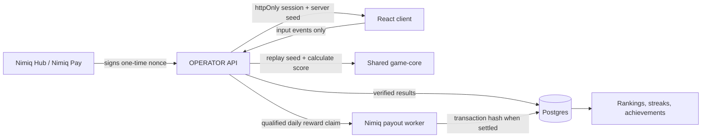

# Architecture

OPERATOR has three runtime layers:

- `src/` is the React client. It renders practice games, starts wallet-authenticated runs, and sends replay events.
- `packages/game-core/` contains deterministic puzzle generation and replay validation shared by the client and API.
- `server/` is the Hono API. It owns sessions, run seeds, replay validation, scores, leaderboards, profiles, and daily reward requests.

The client never writes an authoritative score to the database. Nimiq establishes who the operator is; server replay establishes what they earned.

Ranked flow:

1. The wallet signs a server nonce.
2. The API verifies the signature and creates an httpOnly session.
3. The API creates a run with a private deterministic seed.
4. The client sends input events, never an authoritative score.
5. The API replays the events and stores the calculated result.
